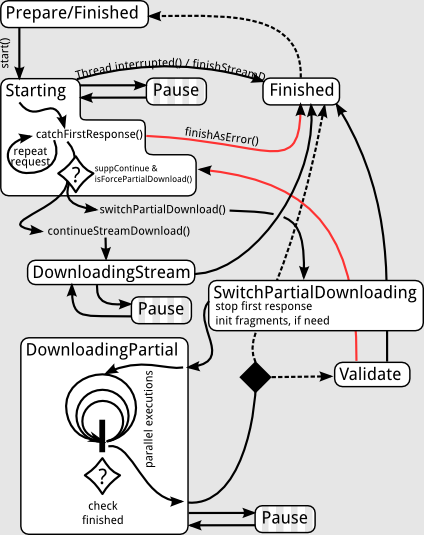

Работа с HTTP
==============

Отправка синхронного GET запроса
--------------------------------

```groovy
import xyz.cofe.http.*

def http = new HttpClient()
def req = http.createRequest( 'http://cofe.xyz/' )
req.async = false

def res = req.createResponse()
res.start()

println res.text
```

Асинхронный запрос
------------------

```groovy
import xyz.cofe.http.*
import java.net.URL

def http = new HttpClient()

// Указываем таймауты
http.connectTimeout = 5 * 1000
http.readTimeout = 10 * 1000

// Указываем клиента
http.userAgent = 'sample agent'

// Кодировка по умолчанию
http.defaultCharset = java.nio.charset.Charset.forName( 'UTF-8' )

def req = http.createRequest( 'http://cofe.xyz/' )

// Запрос асинхронный
req.async = true

// Следовать перенаправлениям
req.followRedirect = true

// Тип запроса
req.method = 'GET'

// Максимальное кол-во загружаемых байтов
req.maxDownloadSize = (long)(128 * 1024)

def res = req.createResponse()

// Подписчик на события
res.addListener new HttpListenerAdapter(){
	protected void responseProgress( HttpResponse.ProgressEvent ev, HttpResponse resp ){
		println "progress $resp.downloadedSize / $resp.httpHeaders.contentLength"
	}

	protected void responseStateChanged(
		HttpResponse.StateChangedEvent event,
		HttpResponse response,
		HttpResponse.State oldState,
		HttpResponse.State newState )
	{
		println "state changed $oldState -> $newState"
	}

	protected void responseRedirect(HttpResponse.RedirectEvent event, HttpResponse response, URL from, URL to){
		println "redirect $from -> $to"
	}

	protected void responseFinished(HttpResponse.StateChangedEvent event, HttpResponse response) {
		println "finished"
	}
}

// Выполняем запрос
res.start()

// Ожидаем завершения
res.waitForFinished()

println "Errors count: ${res.errors.size()}"
res.errors.eachWithIndex { err, erri ->
	println "error $erri $err"
}

println "Status $res.statusCode $res.statusMessage"

println "Response header:"
res.httpHeaders.multiMap.each { key, vals ->
	if( vals.size()==1 ){
		println "$key: ${vals[0]}"
	}else{
		println "$key:"
		vals.each { println "  $it" }
	}
}

println "Text:\n\n$res.text"
```

Докачка файлов
--------------

Докачка файлов осуществляется специальным классом `xyz.cofe.http.HttpDownloader`.

Основные функции:

- Сохрание состояние закачки
- Восстановление состоянии закачки
- Получение данных из нескольких источников
- Проверка полученной порции данных
- Повторный запрос на получение порции данных
- Работа в нескольких потоках (треды)
- Поддержка паузы и возобновления
- Получение информации о скаченых и ожидающих докачки фрагментов
- Поддержка событий о работе закачки
- Счетчики производительности

### Состояния закачки

Состояние закачки представллено классом `xyz.cofe.http.ContentFragments`.

Для класса `HttpDownloader` есть соотв. свойство `fragments : ContentFragments`

Класс `ContentFragments` реализует интерфейс `List<xyz.cofe.common.ContentFragment>` и соответю содержит список фрагментов закачиваемого файла.

Каждый фрагмент `ContentFragment` содержит следующую информацию

- свойство `begin : long` - начало фрагмента
- свойство `end : long` - конец фрагмента
- свойство `downloadedSize : long` - кол-во скаченных байтов
- свойство `md5 : String` - хэш скаченных байтов

Текущее состояние закачки можно сохранить/восстановить в файл используя методы `writeXml/readXml`
и возобновить закачку методом `start(savedState)`

### Состояния HttpDownloader

Состояние объекта *HttpDownloader* можно представить виде диаграммы



### Пример 1

```groovy
import xyz.cofe.http.*
import xyz.cofe.http.download.*
import java.net.URL
import java.nio.charset.Charset
import xyz.cofe.cbuffer.CFileBuffer

http = new HttpClient()

// Указываем таймауты
http.connectTimeout = 5 * 1000
http.readTimeout = 10 * 1000

// Указываем клиента
http.userAgent = 'sample agent'

// Кодировка по умолчанию
http.defaultCharset = Charset.forName( 'UTF-8' )

// Создаем запрос - откуда скачиваем файл
def req = http.createRequest( 'http://gocha-vm.nikom.ru/dist/download/admin-scripts.7z' )

// Запрос асинхронный
req.async = true

// Следовать перенаправлениям
req.followRedirect = true

// Тип запроса
req.method = 'GET'

// Куда будем писать данные
req.contentBuffer = new CFileBuffer( new File( '/home/user/Загрузки/admin-scripts.7z' ) )

// Создание докачки
downlr = http.createDownloader( req )

// Выполнять асинхронно
downlr.async = true

// Если поддерживается, то использовать докачку по возможности
downlr.allowPartialContent = true

// Если поддерживается, то принудительно использовать докачку
downlr.forcePartialDownload = true

// Указывает размер фрагмента по умолчанию
downlr.defaultFragmentSize = 1024*1024

// Указывает максимальное возможное кол-во паралельных потоков
downlr.maxParallesGetParts = 5

downlr.onFinished { HttpDownloader dl ->
    // закачка закончилась
    println "download finished"
}

// Просмотр прогресса скачивания
downlr.addListener( new HttpListenerAdapter(){
  protected void downloaderStateChanged(
     HttpDownloader.StateChangedEvent event,
     HttpDownloader downloader,
     HttpDownloader.State oldState,
     HttpDownloader.State newState
  ){
    // смена состояния закачки
  }

  protected void downloaderProgress(
    HttpDownloader.ProgressEvent event,
    HttpDownloader dl
  ){
    // прогресс закачки
    long totalSize = dl.getTotalSize();
    long downloaded = dl.getDownloadedSize();

	// процент закачки
    int pct = downloaded * 100 / totalSize;

    println "download ${downloaded}/${totalSize} ${pct}%"
  }
});

// Восстановление предыдущего состояния
ContentFragments savedState = ...

// Запуск скачивания
if( savedState!=null ) {
  dlr.start(savedState);
} else {
  dlr.start();
}

// Ожидание завершения
dlr.waitForFinished()

// Сохранение состояния
savedState = dlr.getFragments()
```