Обзор возможностей cxconsole
==================================

Преамбула
----------------------------------

Является администратором, мне понадобился инструмент для написания и отладки скриптов который выполнял следующие требования:

* Быстрое написание скритов, с возможность их выполнения
* Средство написания скриптов и среда выполения должны быть портабельными
* Среда должна быть расширяемая и конфигурируемая под задачи

Для языка Groovy есть стандартная среда для написания скриптов [GroovyConsole](http://groovy-lang.org/groovyconsole.html), но по ряд возможностей необходимых мне отсуствовали, которые я реализовал в собственной разработке.

Среда выполенения скриптов JSR233/Groovy
----------------------------------------

* Свойства текстового редактора
	* Подстветка синтаксиса Groovy/JavaScript/XML/Bash/SQL/...
	* Настраиваемые комбинации клавиш
	* Многооконный интерфейс с использованием dock панелей (наподобие eclipse/netbeans/...)
	* Поддержка различных тем оформления
	* Автоматическое сохранение редактируемых документов
	* Отслеживание изменения редактируемых файлов сторонними программами
	* и другие мелочи (кодировка симвлов, перевода строк, поиск и замена)
* Написание скриптов
	* Скрипты выполняются внутри JVM машины
		* в отдельном потоке/группе потоков
		* с возможностью принудительной остановки
	* Возможность задейстовать одновременно несколько языков (Groovy/JavaScript/SQL/...)
		* Есть возможност добавить свой/дополнительный скриптовый язык
		* Поддержка скриптовых языков в соответствии спецификации JSR233 (JRuby,Jython,Groovy,JavaScript,Kotlin,Scala,...)
		* Поддержка Groovy ([GroovyShell](http://docs.groovy-lang.org/latest/html/api/groovy/lang/GroovyShell.html))
	* Для каждого скрипта есть возможность настройки сторонних Java библиотек/CLASSPATH
	* Поддержка native библиотек
		* Поддержка win/linux/mac средствами JNA
		* Поддержка windows - COM/ActiveX, WMI - средствами JACOB
	* Написание скриптов в цикле REPL (Read-Прочесть/Evaluate-Выполнить/Print-Распечатать/Loop-Повторить)
		* Есть возможность редактировать текущие переменные скрипта
* Автономность скриптов
	* Есть возможность запуска скриптов из терминала/командной строки, без среды
	* Переносимость скриптов (portable)
	* Можно создавать exe (windows) приложения (средствами winrun4j)
	* Есть возможность создавать службы windows (средствами winrun4j) _portable функции не доступны_

Текстовый редактор
------------------------------

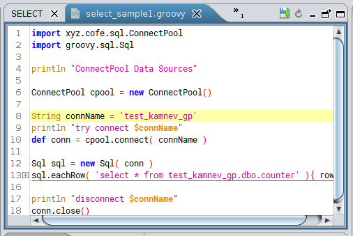

Текстовый редактор на базе [RSyntaxTextArea](https://github.com/bobbylight/RSyntaxTextArea)

* **Syntax Highlighting** Более 40 языков поддерживаются в готовом виде, с возможностью динамического добавления поддержки для большего количества.
* **Code-folding** с учетом языка для многих встроенных языков.
* **Find/Replace** регулярные выражения, поиск и замена.
* **Темы оформления** предопределлено несколько тем оформления.

Темы оформления
---------------

Темы оформления доступны для редактора текста, ниже снимки экрана с указанными темами

### Default
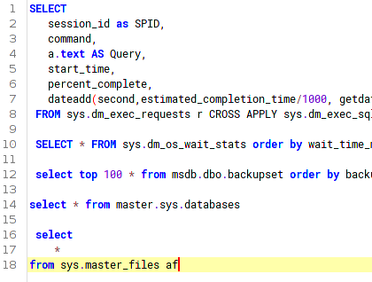

### Eclipse
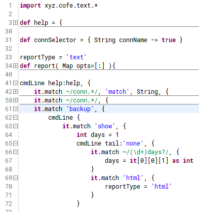

### Idea
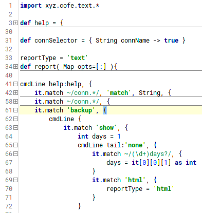

### VS
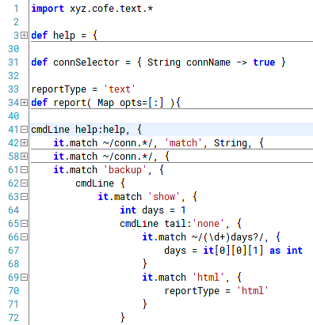

### Dark
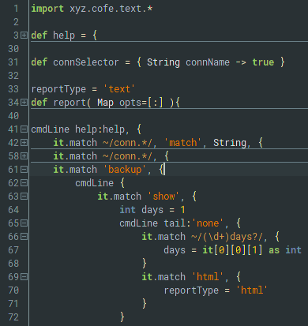

### Monokai
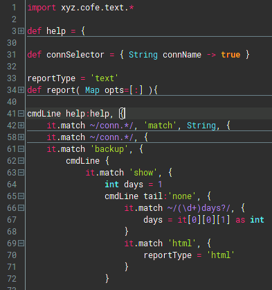

Интерфейс с использованием док панелей
--------------------------------------

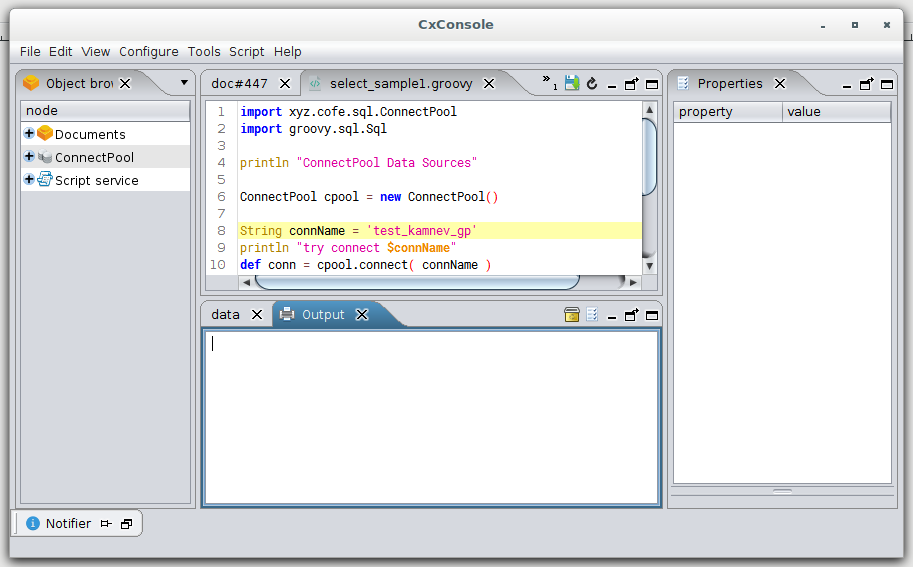

Пользовательский интерфейс построе с использованием библиотеки [Docking Frames](http://www.docking-frames.org/)

Настраиваемые комбинации клавиш
-------------------------------

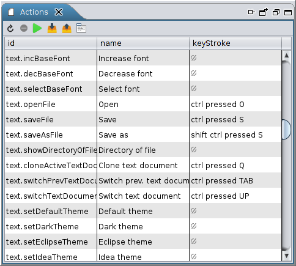

Окно настройки комбинаций клавиш открывается через меню: *Configure ⇒ Configure actions*

В этом окне можно переопределить комбинации клавиш, а так же выгрзить/загрзить их в XML файл

Несколько языков одновременно
-----------------------------

Для выполнения скриптов можно создать несколько различных экземпляров скриптовых движков, для этого

1. Откройте окно *Object browser* меню *Tools ⇒ Object Browser*
2. Перейдите к ветке *Script service / engines* и правым кликом мыши выберете пункт в контекстном меню *Create engine ⇒ <язык программирования/скрипт движок>* <br/> 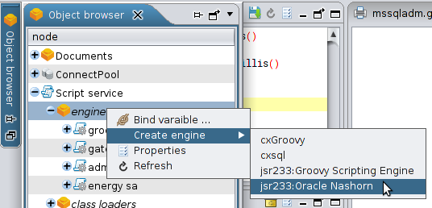
3. Укажите название экземпляра и нажмите ok.
   <br/> 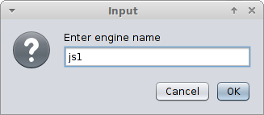
   <br/> Появится ветка с указаным именем (js1)
4. Если необходимы стороние java библиотеки, то идем в ветку *Script service / class loaders*, правым кликом выбираем пункт *Create ClassLoader ⇒ GroovyClassLoader*
5. Указываем имя (например js1) и нажимаем ok
6. В появшейся ветке (*Script service / class loaders / js1*) правым кликом выбираем пункт *Append classpath ⇒ file/dir*
7. В диалоге выбираем интересующие jar файлы / каталоги и нажимаем ok

Так можно создать несколько разных движков с разным набором библиотек.

Что бы использовать созданый движок необходимо:

1. Создать тексовый документ или перейти к созданому (щелкнуть в документ мышью)
2. В строке статуса, в правом нижем углу, напротив зеленого трекгольника щелкнуть в слово `not selected`
   <br/> 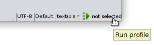
3. В появившимся окне выбрать созданый движок и нажать ок (или два раза кликнуть на имени)
   <br/> 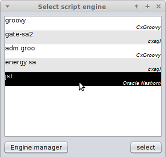


Монитор выполнения и окно вывода
--------------------------------

Набрав текст скрипта, его можно отправить на выполнение *Script ⇒ Execute*.

Автоматически откроется окно *имя_скрипта output* в которое будет отображаться стандартный вывод скрипта (stdio/System.out.print...).

Так же можно открыть монитор выполнения *Tools ⇒ Execute monitor*, в мониторе можно посмотреть текущие выплоняемые скрипты и остановить зависшие (красная прямоугольная кнопка)

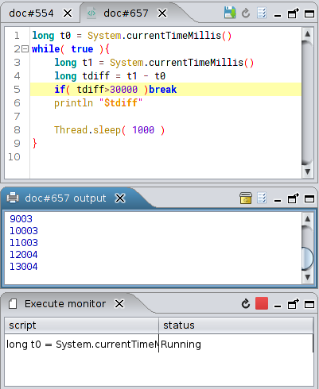

Окно "Bindings Manager" и "Properties"
-------------------------------------

В процессе написания и выполнения скриптов в памяти cxconsole создаются переменные, так их значения можно посмотреть и отредактировать без написания дополнительного кода.

Для примера допустим мы создали CxGroovy движок (язык Groovy) и выполнили следующий код

```groovy
a = 1
b = new Object(){
	int p1 = 12
	int getP2(){ p1*p1 }
}
```

После выполнения этого кода, будут созданы две переменные: a и b.

Что бы посмотреть их текущее значение откройте окно *Bindings Manager* меню *Tools ⇒ Bindings Manager*

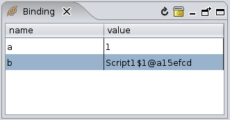

Значение переменной **a** можно отредактировать просто щелкнув мышью в поле value (1).

А посмотреть/редактировать свойства переменной **b** - удерживаю клавишу CONTROL щелкнуть в название переменной (b) - откроется окно Properties

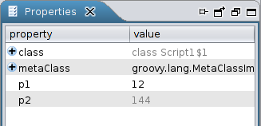

Дистрибутив
------------

Актуальные ссылки на дистрибутив [см здесь](dist.md).

На текущий момент поддерживаются JAVA 7,8,10 и тестироваловаль на
* Windows 2003
* Windows 2008
* Windows 7
* Windows 10
* Ubuntu 16
* Ubuntu 18

Задействованые библиотеки
-------------------------
* [JNA](https://github.com/java-native-access/jna)
* JACOB: [sourceforge](https://sourceforge.net/projects/jacob-project/), [docs](http://danadler.com/jacob/)
* [Docking Frames](http://www.docking-frames.org/)
* [net.java.balloontip](https://mvnrepository.com/artifact/net.java.balloontip/balloontip/1.2.4.1)
* [RSyntaxTextArea](https://github.com/bobbylight/RSyntaxTextArea)
* [Groovy](http://groovy-lang.org/)
* [WinRun4J](http://winrun4j.sourceforge.net/)
* [Apache Commons Codec](https://mvnrepository.com/artifact/commons-codec/commons-codec/1.10)
* [mapdb 2](http://www.mapdb.org/changelog-archive/)