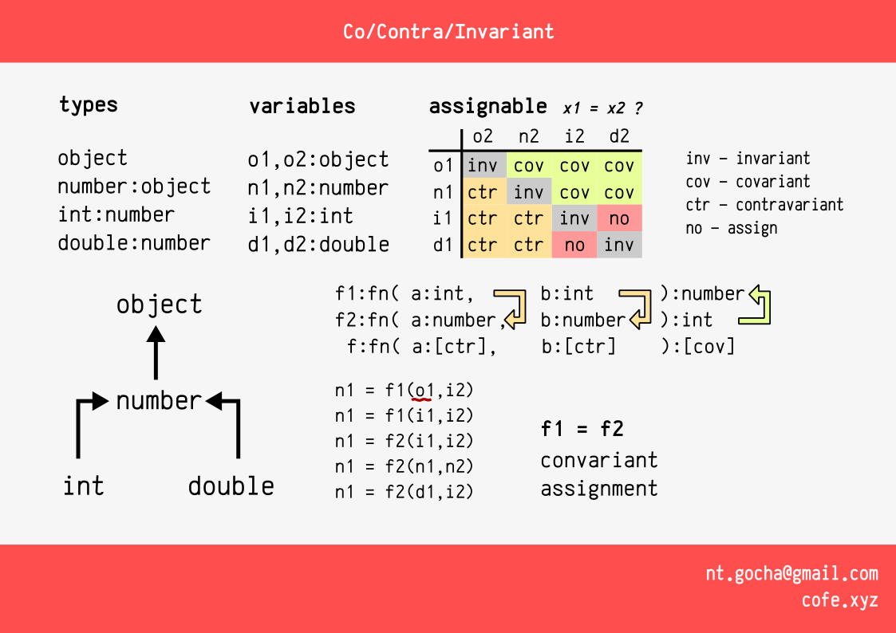

Ко/Контр вариантность
===========================

В язке Java есть несколько типов данных, рассмотрим следующие

* `object` - базовый тип
* `number` - для всех числовых типов данных, наследуется от object
* `int` - для целых числовых типов, наследуется от number, занимает 4 байта
* `double` - для дробных числовых типов, наследуется от number, занимает 8 байт

На картинке отображены 8 переменных:

* `o1,o2` - тип `object`
* `n1,n2` - тип `number`
* `i1,i2` - тип `int`
* `d1,d2` - тип `double`

Операция присвоения
----------------------

В основе правил присваения следующее:

**Для переменной x типа X, можно присвоить значение типа X или дочернего типа данных X**

т.е. для переменной `n1` допустимы операции:

    n1 = n2 // т.е. number тип полностью совметим с самим с собой (number)

    n1 = i1 // т.е. int расширяет number, 
    n1 = i2 // и все операции над number доступны и для int

    n1 = d1 // т.е. double расширяет number, 
    n1 = d2 // и все операции над number доступны и для double

И не допустипы операции:

    n1 = o1 // т.к. object не является number
    n1 = o2 //    и object не является дочерним к number

Так же для переменной `o1,o2` доступны любые операции присвоения, 
среди указанных, а для `d1,d2` доступны только операции присвоения 
для типов double

Отношения операции присвоения
------------------------------

Можно обобщить операции присвоения и построить возможные отношения между типами данных
в аспекте операции присвоения.

Рассмотри в общем:

    left операция(=) right

* left - переменная некого типа Left
* right - переменная некого типа Right

| Left | Right | в коде | Отновшение left к right |
|------|------|--|----------|
| Left = Right | Right = Left |  | Инвариантность (_inv_)
| Left - родитель к Right | Right - дочерний к Left | `class Right extends Left` | left ко-вариантен к right (_cov_)
| Left - дочерний к Right | Right - родитель к Left | `class Left extends Right` | left контр-вариантен к right (_ctr_)
| Left нет пересечений с Right | Right нет пересечений с Left | | нет вариантов (_no_)

* Отношения ко-вариантность и контр-вариантность - взаимно противоположны, и взаимо исключающие
  * В случае если `left операция(=) right` ко-варинтна, тогда `right операция(=) left` контр-варианта
  * В случае если `left операция(=) right` контр-варинтна, тогда `right операция(=) left` ко-варианта

Расширеный пример присвоения
-----------------------------

В разрвнх языках, где есть lambda, поддерживается переменные которые могут указывать на функции.

Для примера (Java 8+):

    BiFunction<Integer,Integer,Number> f1 = (a,b) -> a+b;
    BiFunction<Number,Number,Integer> f2 = ...;

Теперь код вызова

    Number n1 = f1( 10, 12 )
    Number n2 = f2( 10, 12 )

С точки зрения компилятора код выше возвращает один и тот же тип данных,
т.к. вызов f2, хоть и возвращает Integer, но Integer является так же Number - т.е. результат вызова f2 ко-вариантен к f1

Аргументы вызова вступают в противоположное отношения:

    Integer a1 = 10
    Integer a2 = 12

    Number n1 = f1( a1, a2 )
    Number n2 = f2( a1, a2 )

* Аргменты `a1,a2` инвариантны к `f1`
* Аргменты `a1,a2` контр-варинтны к `f2` (Integer дочерен к Number)
  * Аргументы `f2` имеют тип `Number`, который ковариантен к `Integer`
  * Ключевым моментом, с какой стороны мы смотрим на значения:
    * **Со стороны вызывающей** - контр-вариантность
    * **Со стороны принимающей** - ко-вариантность
    * В случае вызывающей и вызваемой стороны, меняются местами отношения

Сами переменные-функции `f1, f2` тоже относяться в отношении:

* `f1` **ко-вариантна** к `f2` - т.е. допустима операция `f1 = f2` **допустима**
* `f2` **контр-вариантна** к `f1` - т.е. допустима операция `f2 = f1` **не допустима**