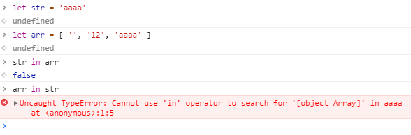
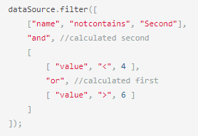

DevExpress filter formal syntax
=================================

Официальное описание фильтров dev express приведено [здесь](https://js.devexpress.com/Documentation/Guide/Data_Binding/Data_Layer/#Reading_Data/Filtering)

Есть ряд вопросов к devexpress, которые будут приведены ниже

Из оф. документации следует следующее:

* Фильтр - является булевым выражением
* Фильтр - может содержать другие фильтры, объединенные через операторы
* Операторы - "именованные" функции:
  * 1 - Унарные операторы
  * 2 - Бинарные операции
  * 3 - Групповые операции
  
Бинарные операции
==========

Есть следующие бинарные операции: "=", "<>", ">", ">=", "<", "<=", "startswith", "endswith", "contains", "notcontains".

Формальная запись была бы

    binaryOperator ::= leftBinary binaryOpToken rightBinary
    binaryOpToken ::= "=", "<>", ">", ">=", "<", "<=", "startswith", "endswith", "contains", "notcontains"

**Требуется определить**

Формальное значение левого (leftBinary) и правого (rightBinary) операнда
С какими типами данных они могут использоваться, и какой тип результата будет

В примерах есть

    dataSource.filter("value", ">", 3)

исходя из примера нельзя точно сказать чем является value - строкой, полем структуры данных или еще чем, т.е. вот возможный противоречивый выдуманный пример

    dataSource.filter("values", "contains", "values")

Из данной конструкции нельзя сказать что values - это строка или массив значений, вполне возможно что:

* leftBinary values - это строка, rightBinary values - это массив js
* leftBinary values - это массив js, rightBinary values - это строка

Что может привести к неоднозначным последствиям

**Предложение**

* Формально "на бумаге" определить типы данных (строки, числа, булево, дата-время, объекты, массивы, ...)
* Формально определить возможные операции над данными типами данных (сравнения, сложения, ...) с определением типа результата

Унарные операции
================

В примере dev express используется оператор ! - который действует как логическая операция - НЕ

Официально - данная операция применима к бинарным операциям

    dataSource.filter( ["!", ["value", "=", 3]] );

**Вопросы**

* Применима ли данная операция к значениям (переменным/литералам)?
* Если да, то к каким типам данных ?
* Применима ли данная операция к самой себе ? ( ! ! true )

**Предложение**

Предложение аналогично бинарным операциям

Групповые операции
=======================

В официальной документации есть две операции: and, or, которые применимы к бинарным операциям

Возможно использовать комбинации and и or образуя дерево логических выражений

Пример

**Вопросы**

* данные оператор применим только к бинарным операциям ?
* например возможно ли применять к значениям ? (field1 and field2)
