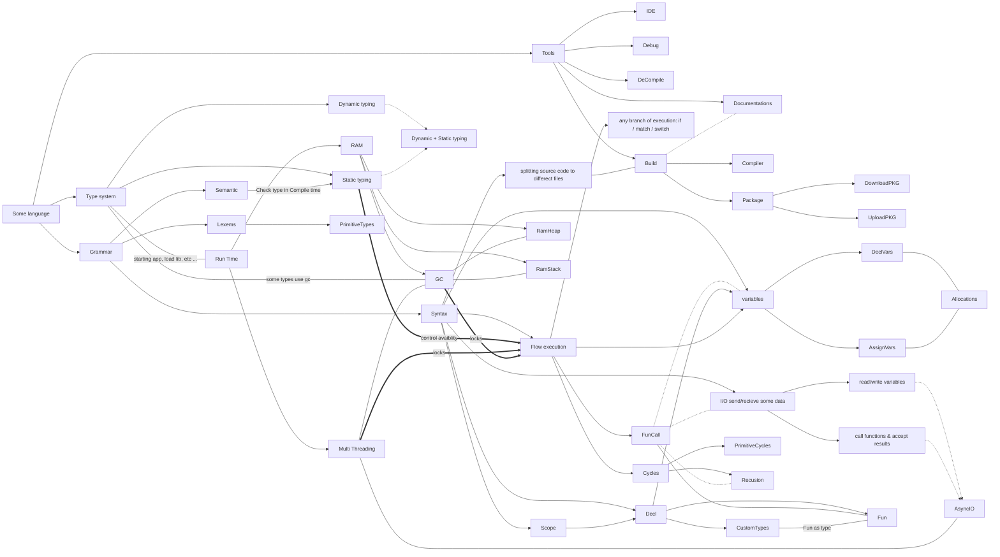

Языки программирования, структурное разделение теории по языкам
====================================================================

Любой язык программирования можно уложить в обхем виде так,

В явном или не явном виде присуствуют эти понятия в любом языке, если отсуствуют, то стоит задаться вопросом, а как в рамках языка и сообщества, жти вопросы решаются.

- Стрелками показано либо влияние, либо деление
- Без стрелок - наличие прямой связи, или косвенной (пунктир)
- Жирные стрелки - наиболее "топкие" места для новичков, по сколько для них, это обычно кажуться простыми, но как они работают, не знают, и по факту являются магией, а потом ловят ошибки

- [TypeSystem](https://ru.wikipedia.org/wiki/%D0%A1%D0%B8%D1%81%D1%82%D0%B5%D0%BC%D0%B0_%D1%82%D0%B8%D0%BF%D0%BE%D0%B2)
  - [Dynamic typing](https://ru.wikipedia.org/wiki/%D0%94%D0%B8%D0%BD%D0%B0%D0%BC%D0%B8%D1%87%D0%B5%D1%81%D0%BA%D0%B0%D1%8F_%D1%82%D0%B8%D0%BF%D0%B8%D0%B7%D0%B0%D1%86%D0%B8%D1%8F)
  - [Static typing](https://ru.wikipedia.org/wiki/%D0%A1%D1%82%D0%B0%D1%82%D0%B8%D1%87%D0%B5%D1%81%D0%BA%D0%B0%D1%8F_%D1%82%D0%B8%D0%BF%D0%B8%D0%B7%D0%B0%D1%86%D0%B8%D1%8F)
  - [Run time](https://ru.wikipedia.org/wiki/%D0%A1%D1%80%D0%B5%D0%B4%D0%B0_%D0%B2%D1%8B%D0%BF%D0%BE%D0%BB%D0%BD%D0%B5%D0%BD%D0%B8%D1%8F)
- [Grammar](https://ru.wikipedia.org/wiki/%D0%A4%D0%BE%D1%80%D0%BC%D0%B0%D0%BB%D1%8C%D0%BD%D0%B0%D1%8F_%D0%B3%D1%80%D0%B0%D0%BC%D0%BC%D0%B0%D1%82%D0%B8%D0%BA%D0%B0)
- [Tools](https://tproger.ru/articles/ot-novichka-k-profi--5-klyuchevyh-instrumentov-dlya-kazhdogo-razrabotchika)
