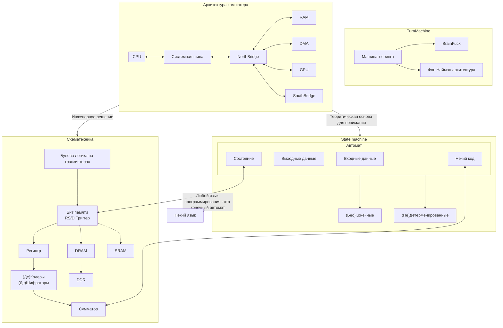
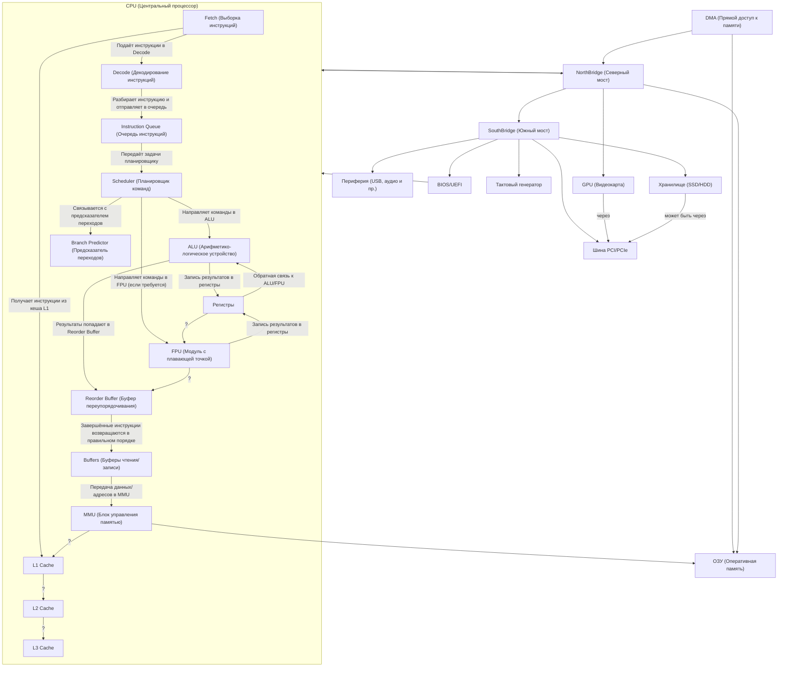
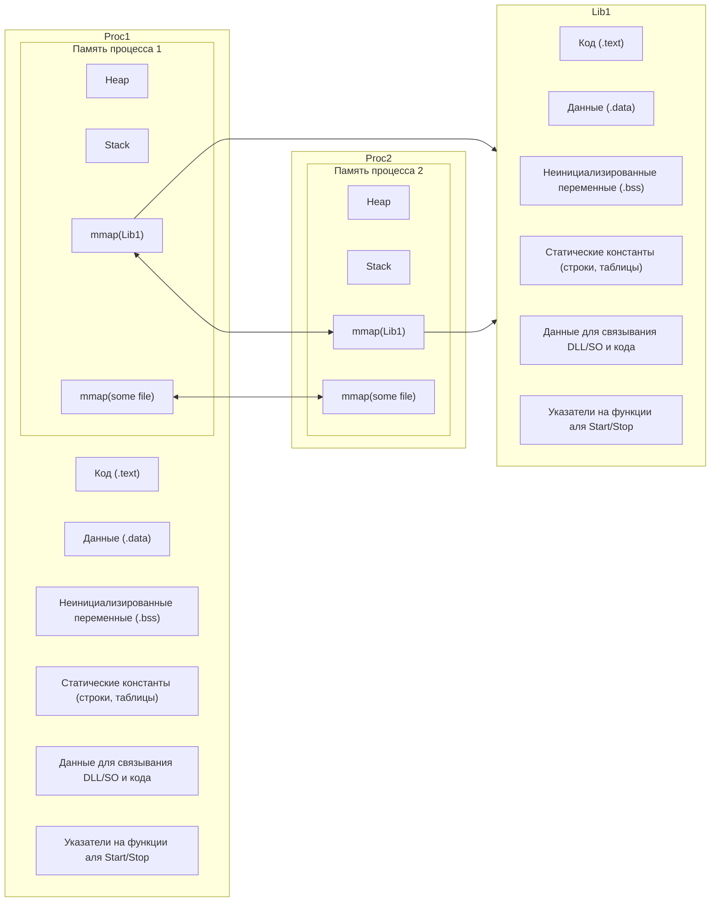

Организация памяти - базовые концепты
================================

Как организована память в совменных ОС, и современных языках программирования - как это инженерно решено
и как это влияет на написание стабильных программ - оооочень большая тема

- [Базавая схематехника, логика](https://codeby.school/blog/informacionnaya-bezopasnost/proektiruem-svoy-kompyuter-nachalo)
- [Элементарная ячейка памяти](https://codeby.school/blog/informacionnaya-bezopasnost/elementarnaya-yacheyka-pamyati-proektiruem-svoy-kompyuter-chast-2)
- [Регистр](https://codeby.school/blog/informacionnaya-bezopasnost/registr-proektiruem-svoy-kompyuter-chast-3)
- [Декодер и оперативная память](https://codeby.school/blog/informacionnaya-bezopasnost/dekoder-i-operativnaya-pamyat-proektiruem-svoy-kompyuter-chast-4)
- [Дешифратор](https://ru.wikipedia.org/wiki/%D0%94%D0%B5%D1%88%D0%B8%D1%84%D1%80%D0%B0%D1%82%D0%BE%D1%80)
- [Декодеры и кодеры](https://course-cst.narod.ru/lec_page12.html)
- [Арифметико-логическое устройство — Проектируем свой компьютер](https://codeby.school/blog/informacionnaya-bezopasnost/arifmetiko-logicheskoe-ustroystvo-proektiruem-svoy-kompyuter-chast-5)

Как это может быть полезно, для программиста

- Машина Тюринга, Конечные автоматы - с этим вы постоянно будете иметь дело, элементарное знание терминов прям сильно облегчат проектирование программ
- СхемаТехника - по большей части программисту не особо нужна, но элементарное знание железа, поможет правильно проектировать те же сервера, СхемаТехника выполняет роль граммонтности, как знание чем римские цифры отличаются от арабских

Архитектура компютера
======================

Архитектура компютера - тут вопрос уже интереснее, в зависимости от вашей роли на проекте и решаемых задач

- Знание, что находиться вне процессора (CPU), BIOS/SSD/... это элементарная граммотность как пользователя компютера
- Знание что внутри CPU, и как оно устроено и связано с внешним - напрямую связано с 2мя разделами: HighLoad и MultiThreading

Организация памяти процесса
==============================

