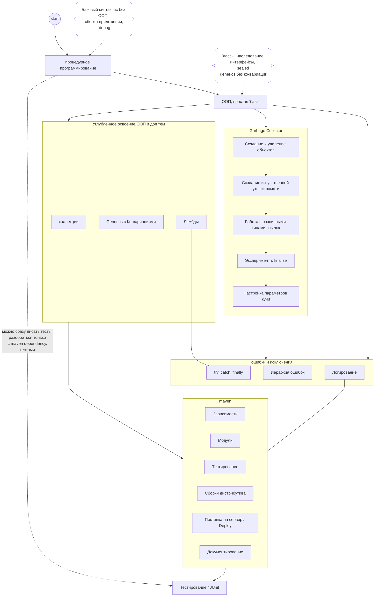

Карта для начала
=================================

```mermaid
flowchart TB

start((start)) --> pp

test1[Тестирование / JUnit]

pp[процедурное программирование]
pp --> oop1["ООП, простая 'база'"]
oop1 --> oop2
oop2 --> maven
oop1 --> gc --> errs
maven --> test1

ppc1@{ shape: braces, label: "Базовый синтаксис без ООП, <br> сборка приложения, <br> debug" } -.-> pp
oop1c1@{ shape: braces, label: "Классы, наследование, интерфейсы, <br> sealed <br> generics без ко-вариации" } -.-> oop1
pp -.-> | можно сразу писать тесты <br> разобраться только <br> с maven dependency, тестами| test1

oop1 --> errs

subgraph oop2["Углубленное освоение ООП и доп тем"]
  coll1[коллекции]
  gen1[Generics с Ко-вариациями]
  lambda1[Лямбды]
end

subgraph errs[ошибки и исключения]
  tcf[try, catch, finally]
  err_h[Иерархия ошибок]
  log[Логирование]
end

lambda1 --- tcf
log --- maven

subgraph maven
 m_dep[Зависимости]
 m_m[Модули]
 m_t[Тестирование]
 m_dist[Сборки дистрибутива]
 m_deploy[Поставка на сервер / Deploy]
 m_docs[Документирование]
end

subgraph gc[Garbage Collector]
  direction TB
  gc1[Создание и удаление объектов]
  gc2[Создание искусственной утечки памяти]
  gc3[Работа с различными типами ссылок]
  gc4[Эксперимент с finalize]
  gc5[Настройка параметров кучи]
  gc1 --> gc2 --> gc3 --> gc4 --> gc5
end

click pp "https://github.com/gochaorg/blog/blob/master/itdocs/learn-java/01-proc.md"
click gen1 "https://github.com/gochaorg/blog/blob/master/itdocs/learn-java/05-oop-advanced-with-answers.md#-%D1%8D%D1%82%D0%B0%D0%BF-2-%D0%B2%D0%B2%D0%B5%D0%B4%D0%B5%D0%BD%D0%B8%D0%B5-%D0%B2-generics-%D1%82%D0%B8%D0%BF%D0%BE%D0%B1%D0%B5%D0%B7%D0%BE%D0%BF%D0%B0%D1%81%D0%BD%D0%BE%D1%81%D1%82%D1%8C-%D0%B8-%D0%B1%D0%B0%D0%B7%D0%BE%D0%B2%D1%8B%D0%B5-%D0%BE%D0%B3%D1%80%D0%B0%D0%BD%D0%B8%D1%87%D0%B5%D0%BD%D0%B8%D1%8F"
click lambda1 "https://github.com/gochaorg/blog/blob/master/itdocs/learn-java/05-oop-advanced-with-answers.md#-%D1%8D%D1%82%D0%B0%D0%BF-4-%D0%BB%D1%8F%D0%BC%D0%B1%D0%B4%D1%8B-%D0%BE%D1%82-%D0%B0%D0%BD%D0%BE%D0%BD%D0%B8%D0%BC%D0%BD%D1%8B%D1%85-%D0%BA%D0%BB%D0%B0%D1%81%D1%81%D0%BE%D0%B2-%D0%BA-%D1%84%D1%83%D0%BD%D0%BA%D1%86%D0%B8%D0%BE%D0%BD%D0%B0%D0%BB%D1%8C%D0%BD%D0%BE%D0%BC%D1%83-%D1%81%D1%82%D0%B8%D0%BB%D1%8E"
click oop1 "https://github.com/gochaorg/blog/blob/master/itdocs/learn-java/02-oop-basic-v1.md"
click gc1 "https://github.com/gochaorg/blog/blob/master/itdocs/learn-java/03-gc.md#%D0%B7%D0%B0%D0%B4%D0%B0%D0%BD%D0%B8%D0%B5-1-%D1%81%D0%BE%D0%B7%D0%B4%D0%B0%D0%BD%D0%B8%D0%B5-%D0%B8-%D1%83%D0%B4%D0%B0%D0%BB%D0%B5%D0%BD%D0%B8%D0%B5-%D0%BE%D0%B1%D1%8A%D0%B5%D0%BA%D1%82%D0%BE%D0%B2"
click gc2 "https://github.com/gochaorg/blog/blob/master/itdocs/learn-java/03-gc.md#%D0%B7%D0%B0%D0%B4%D0%B0%D0%BD%D0%B8%D0%B5-5-%D1%81%D0%BE%D0%B7%D0%B4%D0%B0%D0%BD%D0%B8%D0%B5-%D0%B8%D1%81%D0%BA%D1%83%D1%81%D1%81%D1%82%D0%B2%D0%B5%D0%BD%D0%BD%D0%BE%D0%B9-%D1%83%D1%82%D0%B5%D1%87%D0%BA%D0%B8-%D0%BF%D0%B0%D0%BC%D1%8F%D1%82%D0%B8"
click gc3 "https://github.com/gochaorg/blog/blob/master/itdocs/learn-java/03-gc.md#%D0%B7%D0%B0%D0%B4%D0%B0%D0%BD%D0%B8%D0%B5-4-%D1%80%D0%B0%D0%B1%D0%BE%D1%82%D0%B0-%D1%81-%D1%80%D0%B0%D0%B7%D0%BB%D0%B8%D1%87%D0%BD%D1%8B%D0%BC%D0%B8-%D1%82%D0%B8%D0%BF%D0%B0%D0%BC%D0%B8-%D1%81%D1%81%D1%8B%D0%BB%D0%BE%D0%BA"
click gc4 "https://github.com/gochaorg/blog/blob/master/itdocs/learn-java/03-gc.md#%D0%B7%D0%B0%D0%B4%D0%B0%D0%BD%D0%B8%D0%B5-6-%D1%8D%D0%BA%D1%81%D0%BF%D0%B5%D1%80%D0%B8%D0%BC%D0%B5%D0%BD%D1%82-%D1%81-finalize"
click gc5 "https://github.com/gochaorg/blog/blob/master/itdocs/learn-java/03-gc.md#%D0%B7%D0%B0%D0%B4%D0%B0%D0%BD%D0%B8%D0%B5-7-%D0%BD%D0%B0%D1%81%D1%82%D1%80%D0%BE%D0%B9%D0%BA%D0%B0-%D0%BF%D0%B0%D1%80%D0%B0%D0%BC%D0%B5%D1%82%D1%80%D0%BE%D0%B2-%D0%BA%D1%83%D1%87%D0%B8"
```