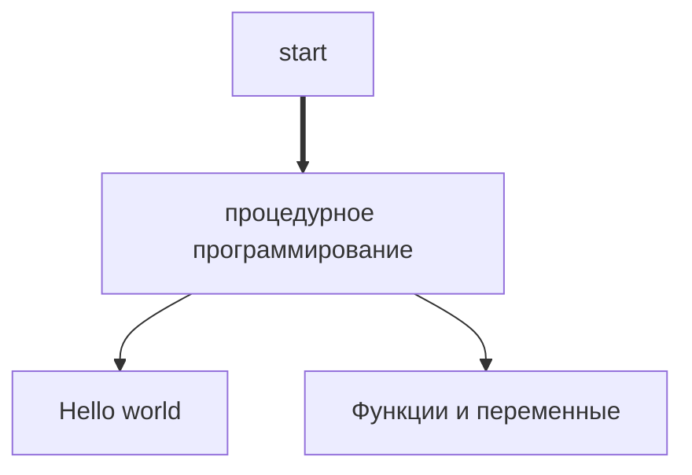

Изучение java
========================

Карта
--------------------------------------------------

Практические задачи
--------------------------------------------------

Задачи сгруппированные в концептуальные части для изучения, отдельных аспектов работы с java

К задачам даны ссылки на материалы, для подготовки

- [Концепт 1 — процедурное программирование](01-proc.md) (junior / must have)
  - Содержание задач
    - Hello World: Запуск программы и структура кода
    - Функции и переменные: Базовый синтаксис
    - Списки и карты: Работа с коллекциями
    - Ввод/вывод с консоли: Работа с пользователем
    - Отладка: Поиск ошибок
    - Создание дистрибутива
    - Maven: Управление зависимостями
    - Работа с файлами: Сохранение данных между запусками
    - Итоговый проект: Консольный трекер задач
- Концепт 2 - ООП, простая "база" (junior / must have)
  - Подразумевает, что есть опыт с Концепт 1 — процедурное программирование  
  - По пробуйте решить задачу для студента,
    - если запутались, то см. аналогичную про библиотеку
    - или решение с ответами
  - Задачи (junior / must have)
    - [Версия задач про библиотеку, в качестве примера](02-oop-basic-v1.md)
    - [Версия задач про Система обработки финансовых операций, для студента с подсказками](02-oop-basic-v2-student.md)
    - [Версия задач про Система обработки финансовых операций, с ответами](02-oop-basic-v2.md)  
    - Содержание задач
      - Классы и объекты: Создание базовых сущностей
      - Наследование
      - Абстрактные классы и интерфейсы
      - Инкапсуляция и геттеры/сеттеры
      - Records: Упрощение immutable-классов
      - Sealed Classes: Контроль иерархии типов
      - Generics: Типобезопасность для коллекций
      - Итоговый проект
- Концепт 3 - [Углубленное освоение ООП и доп тем](05-oop-advanced.md) (junior / must have)
  - Задачи:
    - [Без ответов](05-oop-advanced.md)
    - [С ответами на каверзные воросы](05-oop-advanced-with-answers.md)
  - Содержание задач
    - Коллекции
    - Введение в Generics: Типобезопасность и базовые ограничения
    - Wildcards: Ковариантность и контравариантность
    - Лямбды: От анонимных классов к функциональному стилю
    - Stream API: Промежуточные операции
    - Stream API: Терминальные операции и коллекторы
    - Итоговое задание
- Концепт 4 - [Тестирование](04-test.md) (junior / must have)
  - Содержание задач
    - Модуль 1: Настройка Maven-проекта / Инициализация проекта, управление зависимостями
    - Модуль 2: Юнит-тесты с JUnit
    - Модуль 3: Параметризованные тесты и мокирование
    - Модуль 4: BDD с Cucumber (можно пропустить)
    - Модуль 5: Отладка и отчеты (можно пропустить)
- Концепт 5 - [Maven](07-maven.md) (junior / middle)
  - Задачи помеченные opt (optional) - опциональные, и встречаются редко
  - Содержание задач
    - Основы: Жизненный цикл и простой проект 
    - Ресурсы и свойства: Фильтрация и подстановка значений
    - Глубокое понимание GAV (Group ID, Artifact ID, Version)
    - Управление расположением исходников и ресурсов
    - Множественные проекты: Multi-module архитектура
    - Артефакты и версии: Деплой и управление версиями
    - Генерация версии приложения: Интеграция с Git
    - Документация: Javadoc и исходники
    - Расширенное тестирование: Surefire и профили
    - Документация сайта: Maven Site + Markdown (opt)
    - Дополнительные артефакты: Сборка config.zip (opt)
    - Подпись артефактов: GPG (opt)
    - Профили: Условная компиляция
    - Скрипты: exec, Ant, сторонние команды
    - ServiceLoader: SPI реализация
    - Appassembler: Генерация скриптов запуска
    - Fat JAR: Все зависимости в одном файле
    - Рекурсивная смена версий
    - Написание плагина: greet-maven-plugin (opt)
    - Дерево зависимостей: Анализ и оптимизация
    - Репозитории: Nexus, GitHub, GitLab (opt)
    - Безопасность: Шифрование паролей (opt)
    - Финальная проверка: Полный CI-сценарий (opt)
- Концепт 6 - [Garbage collector](03-gc.md) (junior - middle)
  - Содержание задач
    - Задание 1: Создание и удаление объектов
    - Задание 2: Работа с различными сборщиками мусора
    - Задание 3: Анализ логов сборки мусора
    - Задание 4: Работа с различными типами ссылок
    - Задание 5: Создание искусственной утечки памяти
    - Задание 6: Эксперимент с finalize()
    - Задание 7: Настройка параметров кучи
- Концепт 7 - [Базовое функциональное программирование](06-fp-basic.md) (middle +/-)
  - Содержание задач
    - Чистые функции (Pure Functions)
    - Неизменяемость (Immutability)
    - Функции высшего порядка (HOF)
    - Лямбда-функции и замыкания
    - Функциональная композиция
    - Каррирование и частичное применение
    - Алгебраические типы данных (ADT)
    - Паттерн-матчинг
    - Ленивые вычисления
    - Инкапсуляция эффектов
    - Итоговый проект