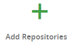

Конфигурация JFrog artifactory oss
===================================

Для использование JFrog artifactory в качестве локального/удаленного maven репозитория готовых артифактов необходимо 

* Создать локальный репозиторий - _локальный в терминах JFrog)
* Настроить доступ к данному репозиторию пользователей

Создание локального репозитория на сервере
------------------------------------------

1. Входим на страницу http://10.1.18.18:8082/ui/admin/repositories/local  

2. Щелкаем **New Local Repository**   
3. Выбираем тип **maven**    
4. Указываем описание   
   * Уникальный идентификатор (Repository Key)
   * Расположение файлов Repository Layout = maven-2-default
   * Описание **Public, Internal Description** - _имя проекта, авторство и т.д._
   * Кол-во уникальных артифактов с одним и тем же id **Max Unique Snapshots** - _лучше больше 0, иначе место кончиться быстро_
   * Отметить/снять галки
     * **Handle Releases** - Принимать/обрабатывать release сборки - _готовые сбоки для заказчиков_
     * **Handle Snapshots** - Принимать/обрабатывать snapshot сборки - _проходные сборки для внутреннего использования_
     
     
   * Сохраняем и завршаем   

Создание/редактирование привилегии записи в репозиторий
-------------------------------------------------

1. Переходим на страницу привилегий http://10.1.18.18:8082/ui/admin/management/permissions   
2. Создаем новую или изменяем существующую привилегию   
   * Указываем идентификатор привилегии, в случае создания новой.   
   * Указываем какие репозитории связаны с данной привилегией 
        
        
   * Указываем на кладках Users / Groups - пользователей или группы пользователей которые должны быть включены в данную привилегию
        
        
   * Для выбранных пользователей/группы указываем какие операции можно делать над репозиторием
        
3. Завершаем процесс - нажимем кнопку создать/сохранить
     

Создание/редактирование группы пользователей
---------------------------------------------

1. Переходим на страницу создание группы http://10.1.18.18:8082/ui/admin/management/groups/new,
   _можно отредактировать существующую группу_   
2. Указываем
   * Уникальное имя группы   
   * Системные права для данной группы пользователей   
   * Указываем состав группы пользователей   
3. Завершаем процесс - нажимем кнопку создать/сохранить   

Создание/редактирование пользователей
-------------------------------------

1. Переходим на страницу создание пользователя http://10.1.18.18:8082/ui/admin/management/users/new _можно отредактировать существующую группу_   
2. Указывает логин и email пользователя   
3. Указывает системные привилегии   
4. Указывает пароль   
5. Указывает в какие группы будет входить пользователь   
6. Ниже будет таблица которая отобразит набор привилегий, которыми будет обладать пользователь   
7. Завершаем процесс - нажимем кнопку создать/сохранить   