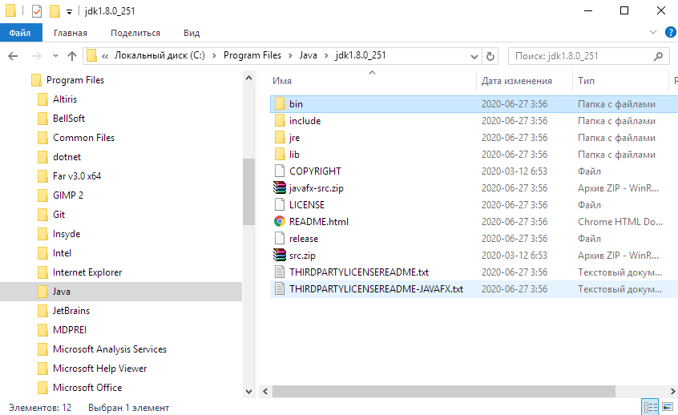
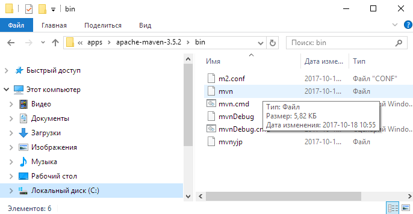
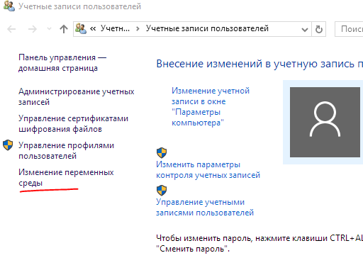
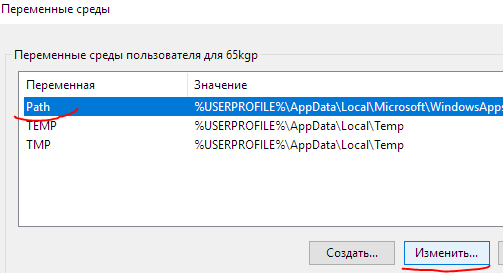
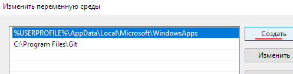
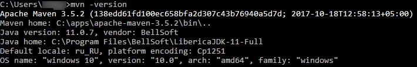

Установка maven
=================

На компьютере пользователя должна быть установлена JAVA 
и прописана переменная окружения JAVA_HOME до каталога java
 
Например так: `JAVA_HOME=C:\Program Files\Java\jdk1.8.0_251`
   

1. Зайти на официальный сайт https://maven.apache.org/download.cgi
2. Скачать актуальную версию **Binary zip archive**
3. Распокавать в любой удобный каталог на рабочей машине   
4. Добавить в пути (PATH) путь до каталога _распакованный архив_\bin
   * Для ОС Windows 10+
     * Открыть окно **Учетные записи пользователей**
       * Выбрать пункт **Изменение переменных среды**    
     * В появившимся окне **Переменные среды**
       * Выбрать переменную **Path** в списке **Переменные среды пользователя для** _XXXX_
       * Нажать кнопку **Изменить ...**    
     * В Окне **Изменить переменную среды**
       * Нажать кнопку **Создать**
       * Добавить путь до каталога _распакованный архив_\bin
       * Нажать кнопку **ОК**    
     * Закрыть окно **Переменные среды** нажав кнопку **ОК**
     * Если есть открытые терминалы (cmd.exe - командная строка), то перезапустить их, чтоб применились новые значения
5. Проверте работу maven  
  Выполните в командной строке `mvn -version`. Должно отобразиться примерно такой текст:   

После установки, переходите к дальнейшей [настройке репозитариев](maven-config.md).