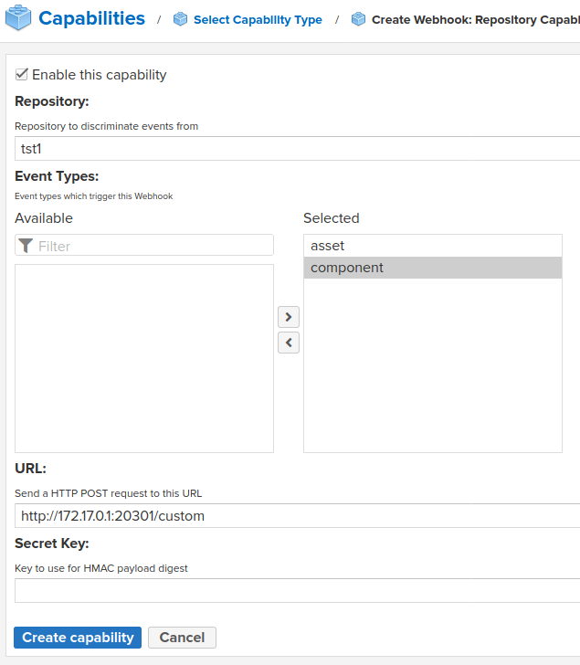

nexus sonatype install
========================

    docker run -d -p 8081:8081 --name nexus sonatype/nexus3

read install password & enter

    docker exec -it nexus /bin/bash
    cd /nexus-data
    cat admin.password

nexus sonatype webhook
=========================

A component in Nexus 3 is an installable unit which is delineated by it's coordinates (such as artifact ID + version number). In some repository formats there is one file per component, but in others there are multiple files per component. So the UI allows browsing repositories by either components or assets (files).

Компонент в Nexus 3 - это устанавливаемый модуль, который определяется своими координатами (такими как идентификатор артефакта + номер версии). В некоторых форматах репозиториев на каждый компонент приходится по одному файлу, но в других - по несколько файлов на компонент. Таким образом, пользовательский интерфейс позволяет просматривать репозитории по компонентам или активам (файлам).

log upload
------------------------
        "timestamp": "2020-11-01T22:15:15.321+00:00",
        "nodeId": "E57A174B-4A6B3930-034D9892-C86243AB-4B5C3A7D",
        "initiator": "admin/172.17.0.1",
        "repositoryName": "tst1",
        "action": "CREATED",
        "asset": {
            "id": "850c80f61c9402e70db75a73a117354a",
            "assetId": "dHN0MTo4NTBjODBmNjFjOTQwMmU3MGRiNzVhNzNhMTE3MzU0YQ",
            "format": "maven2",
            "name": "xyz/cofe/cxel/0.3/cxel-0.3.jar.md5"
        }
    }

request 8

    method POST
    uri /custom
    url http://172.17.0.1:20301/custom
    ip 172.17.0.2
    queryString null
    headers
        Accept-Encoding:gzip,deflate
        Connection:keep-alive
        Content-Length:346
        Content-Type:application/json; charset=UTF-8
        Host:172.17.0.1:20301
        User-Agent:Nexus/3.28.1-01 (OSS; Linux; 5.4.0-52-generic; amd64; 1.8.0_265)
        X-Nexus-Webhook-Delivery:1471bf9e-e4b2-4b92-abd4-916992fedfc0
        X-Nexus-Webhook-ID:rm:repository:asset
    body
    {
        "timestamp": "2020-11-01T22:15:15.345+00:00",
        "nodeId": "E57A174B-4A6B3930-034D9892-C86243AB-4B5C3A7D",
        "initiator": "admin/172.17.0.1",
        "repositoryName": "tst1",
        "action": "CREATED",
        "asset": {
            "id": "d6e4a50aba3c8a19fe764591a09d964a",
            "assetId": "dHN0MTpkNmU0YTUwYWJhM2M4YTE5ZmU3NjQ1OTFhMDlkOTY0YQ",
            "format": "maven2",
            "name": "xyz/cofe/cxel/0.3/cxel-0.3.pom"
        }
    }

request 11

    method POST
    uri /custom
    url http://172.17.0.1:20301/custom
    ip 172.17.0.2
    queryString null
    headers
        Accept-Encoding:gzip,deflate
        Connection:keep-alive
        Content-Length:350
        Content-Type:application/json; charset=UTF-8
        Host:172.17.0.1:20301
        User-Agent:Nexus/3.28.1-01 (OSS; Linux; 5.4.0-52-generic; amd64; 1.8.0_265)
        X-Nexus-Webhook-Delivery:43007bb7-ed69-49b1-88ec-4a9bb9f667d7
        X-Nexus-Webhook-ID:rm:repository:asset
    body
    {
        "timestamp": "2020-11-01T22:15:15.390+00:00",
        "nodeId": "E57A174B-4A6B3930-034D9892-C86243AB-4B5C3A7D",
        "initiator": "admin/172.17.0.1",
        "repositoryName": "tst1",
        "action": "CREATED",
        "asset": {
            "id": "2fff509a7c2a9ebe5c2d2f02a77005c3",
            "assetId": "dHN0MToyZmZmNTA5YTdjMmE5ZWJlNWMyZDJmMDJhNzcwMDVjMw",
            "format": "maven2",
            "name": "xyz/cofe/cxel/0.3/cxel-0.3.pom.md5"
        }
    }

request 6

    method POST
    uri /custom
    url http://172.17.0.1:20301/custom
    ip 172.17.0.2
    queryString null
    headers
        Accept-Encoding:gzip,deflate
        Connection:keep-alive
        Content-Length:351
        Content-Type:application/json; charset=UTF-8
        Host:172.17.0.1:20301
        User-Agent:Nexus/3.28.1-01 (OSS; Linux; 5.4.0-52-generic; amd64; 1.8.0_265)
        X-Nexus-Webhook-Delivery:b89e097b-de5f-48a3-b55d-5a7afd45910e
        X-Nexus-Webhook-ID:rm:repository:asset
    body
    {
        "timestamp": "2020-11-01T22:15:15.379+00:00",
        "nodeId": "E57A174B-4A6B3930-034D9892-C86243AB-4B5C3A7D",
        "initiator": "admin/172.17.0.1",
        "repositoryName": "tst1",
        "action": "CREATED",
        "asset": {
            "id": "be7659c48b868ad422b72fef2c6dc814",
            "assetId": "dHN0MTpiZTc2NTljNDhiODY4YWQ0MjJiNzJmZWYyYzZkYzgxNA",
            "format": "maven2",
            "name": "xyz/cofe/cxel/0.3/cxel-0.3.pom.sha1"
        }
    }

request 3

    method POST
    uri /custom
    url http://172.17.0.1:20301/custom
    ip 172.17.0.2
    queryString null
    headers
        Accept-Encoding:gzip,deflate
        Connection:keep-alive
        Content-Length:346
        Content-Type:application/json; charset=UTF-8
        Host:172.17.0.1:20301
        User-Agent:Nexus/3.28.1-01 (OSS; Linux; 5.4.0-52-generic; amd64; 1.8.0_265)
        X-Nexus-Webhook-Delivery:924280ef-b017-4055-b4e9-0c74489e2ccb
        X-Nexus-Webhook-ID:rm:repository:asset
    body
    {
        "timestamp": "2020-11-01T22:15:15.291+00:00",
        "nodeId": "E57A174B-4A6B3930-034D9892-C86243AB-4B5C3A7D",
        "initiator": "admin/172.17.0.1",
        "repositoryName": "tst1",
        "action": "CREATED",
        "asset": {
            "id": "a4757bcaa62b63064b4c14c2f53a017e",
            "assetId": "dHN0MTphNDc1N2JjYWE2MmI2MzA2NGI0YzE0YzJmNTNhMDE3ZQ",
            "format": "maven2",
            "name": "xyz/cofe/cxel/0.3/cxel-0.3.jar"
        }
    }

request 9

    method POST
    uri /custom
    url http://172.17.0.1:20301/custom
    ip 172.17.0.2
    queryString null
    headers
        Accept-Encoding:gzip,deflate
        Connection:keep-alive
        Content-Length:350
        Content-Type:application/json; charset=UTF-8
        Host:172.17.0.1:20301
        User-Agent:Nexus/3.28.1-01 (OSS; Linux; 5.4.0-52-generic; amd64; 1.8.0_265)
        X-Nexus-Webhook-Delivery:7c864ad4-ef3a-43fa-92ac-9fb4301d4059
        X-Nexus-Webhook-ID:rm:repository:asset
    body
    {
        "timestamp": "2020-11-01T22:15:15.321+00:00",
        "nodeId": "E57A174B-4A6B3930-034D9892-C86243AB-4B5C3A7D",
        "initiator": "admin/172.17.0.1",
        "repositoryName": "tst1",
        "action": "CREATED",
        "asset": {
            "id": "850c80f61c9402e70db75a73a117354a",
            "assetId": "dHN0MTo4NTBjODBmNjFjOTQwMmU3MGRiNzVhNzNhMTE3MzU0YQ",
            "format": "maven2",
            "name": "xyz/cofe/cxel/0.3/cxel-0.3.jar.md5"
        }
    }

request 5

    method POST
    uri /custom
    url http://172.17.0.1:20301/custom
    ip 172.17.0.2
    queryString null
    headers
        Accept-Encoding:gzip,deflate
        Connection:keep-alive
        Content-Length:363
        Content-Type:application/json; charset=UTF-8
        Host:172.17.0.1:20301
        User-Agent:Nexus/3.28.1-01 (OSS; Linux; 5.4.0-52-generic; amd64; 1.8.0_265)
        X-Nexus-Webhook-Delivery:bb009a99-b369-4139-8e52-31ccb6654147
        X-Nexus-Webhook-ID:rm:repository:component
    body
    {
        "timestamp": "2020-11-01T22:15:15.362+00:00",
        "nodeId": "E57A174B-4A6B3930-034D9892-C86243AB-4B5C3A7D",
        "initiator": "admin/172.17.0.1",
        "repositoryName": "tst1",
        "action": "UPDATED",
        "component": {
            "id": "f898b3903cb99c59683597edc5aff9bc",
            "componentId": "dHN0MTpmODk4YjM5MDNjYjk5YzU5NjgzNTk3ZWRjNWFmZjliYw",
            "format": "maven2",
            "name": "cxel",
            "group": "xyz.cofe",
            "version": "0.3"
        }
    }

request 4

    method POST
    uri /custom
    url http://172.17.0.1:20301/custom
    ip 172.17.0.2
    queryString null
    headers
        Accept-Encoding:gzip,deflate
        Connection:keep-alive
        Content-Length:348
        Content-Type:application/json; charset=UTF-8
        Host:172.17.0.1:20301
        User-Agent:Nexus/3.28.1-01 (OSS; Linux; 5.4.0-52-generic; amd64; 1.8.0_265)
        X-Nexus-Webhook-Delivery:cf5ed83d-7fbc-4bab-8598-b5c88419f31e
        X-Nexus-Webhook-ID:rm:repository:asset
    body
    {
        "timestamp": "2020-11-01T22:15:15.460+00:00",
        "nodeId": "E57A174B-4A6B3930-034D9892-C86243AB-4B5C3A7D",
        "initiator": "admin/172.17.0.1",
        "repositoryName": "tst1",
        "action": "CREATED",
        "asset": {
            "id": "24c1fe335d26652fad3d293552aa9cad",
            "assetId": "dHN0MToyNGMxZmUzMzVkMjY2NTJmYWQzZDI5MzU1MmFhOWNhZA",
            "format": "maven2",
            "name": "xyz/cofe/cxel/maven-metadata.xml"
        }
    }

request 2

    method POST
    uri /custom
    url http://172.17.0.1:20301/custom
    ip 172.17.0.2
    queryString null
    headers
        Accept-Encoding:gzip,deflate
        Connection:keep-alive
        Content-Length:353
        Content-Type:application/json; charset=UTF-8
        Host:172.17.0.1:20301
        User-Agent:Nexus/3.28.1-01 (OSS; Linux; 5.4.0-52-generic; amd64; 1.8.0_265)
        X-Nexus-Webhook-Delivery:be6b89c9-9a8b-41b7-959e-8127ef268a9f
        X-Nexus-Webhook-ID:rm:repository:asset
    body
    {
        "timestamp": "2020-11-01T22:15:15.468+00:00",
        "nodeId": "E57A174B-4A6B3930-034D9892-C86243AB-4B5C3A7D",
        "initiator": "admin/172.17.0.1",
        "repositoryName": "tst1",
        "action": "CREATED",
        "asset": {
            "id": "bf0bcff339beef06c69b0f417bd6c60c",
            "assetId": "dHN0MTpiZjBiY2ZmMzM5YmVlZjA2YzY5YjBmNDE3YmQ2YzYwYw",
            "format": "maven2",
            "name": "xyz/cofe/cxel/maven-metadata.xml.sha1"
        }
    }

request 1

    method POST
    uri /custom
    url http://172.17.0.1:20301/custom
    ip 172.17.0.2
    queryString null
    headers
        Accept-Encoding:gzip,deflate
        Connection:keep-alive
        Content-Length:352
        Content-Type:application/json; charset=UTF-8
        Host:172.17.0.1:20301
        User-Agent:Nexus/3.28.1-01 (OSS; Linux; 5.4.0-52-generic; amd64; 1.8.0_265)
        X-Nexus-Webhook-Delivery:664d7f91-7fe9-4cbe-92fb-7e5f0a5ea922
        X-Nexus-Webhook-ID:rm:repository:asset
    body
    {
        "timestamp": "2020-11-01T22:15:15.470+00:00",
        "nodeId": "E57A174B-4A6B3930-034D9892-C86243AB-4B5C3A7D",
        "initiator": "admin/172.17.0.1",
        "repositoryName": "tst1",
        "action": "CREATED",
        "asset": {
            "id": "a4757bcaa62b63060eb927f5e89cd501",
            "assetId": "dHN0MTphNDc1N2JjYWE2MmI2MzA2MGViOTI3ZjVlODljZDUwMQ",
            "format": "maven2",
            "name": "xyz/cofe/cxel/maven-metadata.xml.md5"
        }
    }

request 7

    method POST
    uri /custom
    url http://172.17.0.1:20301/custom
    ip 172.17.0.2
    queryString null
    headers
        Accept-Encoding:gzip,deflate
        Connection:keep-alive
        Content-Length:351
        Content-Type:application/json; charset=UTF-8
        Host:172.17.0.1:20301
        User-Agent:Nexus/3.28.1-01 (OSS; Linux; 5.4.0-52-generic; amd64; 1.8.0_265)
        X-Nexus-Webhook-Delivery:dd8e8b4b-add0-47b1-803a-b3bd870cda73
        X-Nexus-Webhook-ID:rm:repository:asset
    body
    {
        "timestamp": "2020-11-01T22:15:15.304+00:00",
        "nodeId": "E57A174B-4A6B3930-034D9892-C86243AB-4B5C3A7D",
        "initiator": "admin/172.17.0.1",
        "repositoryName": "tst1",
        "action": "CREATED",
        "asset": {
            "id": "48c7a679aa67976bb96e10bf6a03c171",
            "assetId": "dHN0MTo0OGM3YTY3OWFhNjc5NzZiYjk2ZTEwYmY2YTAzYzE3MQ",
            "format": "maven2",
            "name": "xyz/cofe/cxel/0.3/cxel-0.3.jar.sha1"
        }
    }

request 10

    method POST
    uri /custom
    url http://172.17.0.1:20301/custom
    ip 172.17.0.2
    queryString null
    headers
        Accept-Encoding:gzip,deflate
        Connection:keep-alive
        Content-Length:363
        Content-Type:application/json; charset=UTF-8
        Host:172.17.0.1:20301
        User-Agent:Nexus/3.28.1-01 (OSS; Linux; 5.4.0-52-generic; amd64; 1.8.0_265)
        X-Nexus-Webhook-Delivery:2b7f3035-67cd-4037-9192-c961a9b12c1d
        X-Nexus-Webhook-ID:rm:repository:component
    body
    {
        "timestamp": "2020-11-01T22:15:15.289+00:00",
        "nodeId": "E57A174B-4A6B3930-034D9892-C86243AB-4B5C3A7D",
        "initiator": "admin/172.17.0.1",
        "repositoryName": "tst1",
        "action": "CREATED",
        "component": {
            "id": "f898b3903cb99c59683597edc5aff9bc",
            "componentId": "dHN0MTpmODk4YjM5MDNjYjk5YzU5NjgzNTk3ZWRjNWFmZjliYw",
            "format": "maven2",
            "name": "cxel",
            "group": "xyz.cofe",
            "version": "0.3"
        }
    }